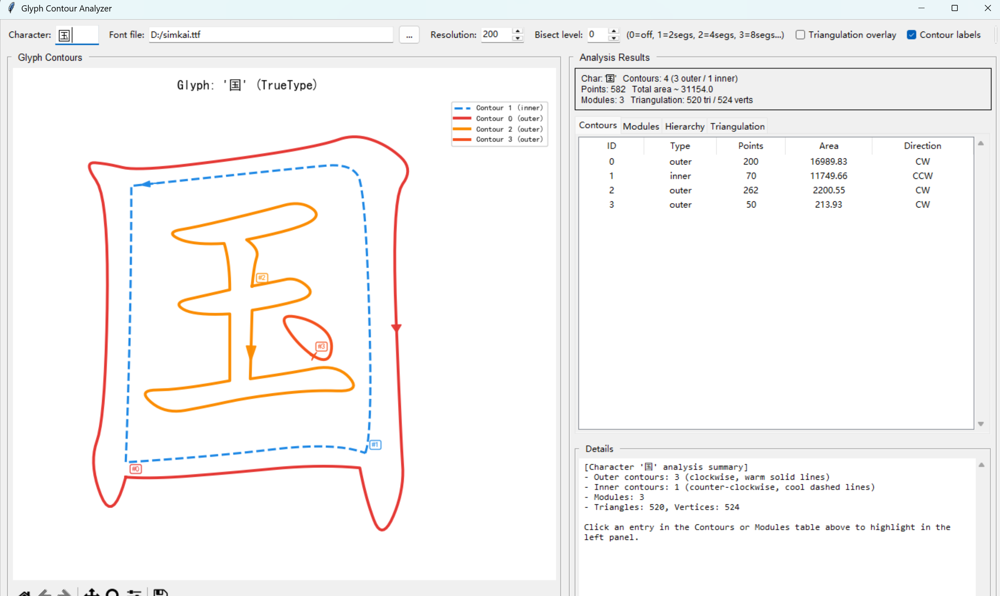

# Glyph Contour Analyzer

A font glyph visualization and analysis tool built with Tkinter + Matplotlib + Shapely. Parses glyph contours from TrueType/OpenType fonts, classifies outer/inner contours, builds modular structures, triangulates the mesh, and displays hierarchical module relationships.

---

## Features

### 1. Glyph Contour Parsing
- Loads TrueType/OpenType glyphs from font files via `freetype-py`
- Processes quadratic B&eacute;zier curves, sampled into polyline point sets
- Auto-normalizes contour orientation (TrueType spec: clockwise for outer, counter-clockwise for inner)

### 2. Outer/Inner Contour Recognition &amp; Module Building
- Automatically distinguishes outer contours from inner contours (holes)
- Matches each inner contour to its directly-enclosing outer contour, building a `GlyphModule`
- Each module = one outer contour + zero or more inner contours (holes)
- Module types:
  - **Type 1 (with holes)**: outer contour encloses &ge; 1 hole
  - **Type 2 (solid)**: outer contour with no holes

### 3. Module Hierarchy Tree
- Builds a hierarchical tree structure based on outer-contour containment
- Each module records: parent index, children indices, depth level in the tree
- **&#22278; (Hui)**: outer box (M1, root, depth 0) &rarr; inner box (M2, child, depth 1)
- **&#22269; (Guo)**: outer frame (M1, root) &rarr; inner solid strokes (M2, M3, children)

### 4. Triangulation
- Triangulates polygons with holes via Shapely's `triangulate()`
- **Precision clipping**: each candidate triangle is intersected with the outer boundary and subtracted from each inner hole
- Supports contour subdivision: line segments can be split into sub-segments to improve triangulation fidelity

### 5. Graphical User Interface
- Left/right split layout (left 2/3 shows contour plot, right 1/3 shows results)
- Left panel &mdash; glyph contour plot:
  - Warm solid lines = outer contours (clockwise)
  - Cool dashed lines = inner contours (counter-clockwise)
  - Direction arrows show winding orientation
  - Module labels (M1, M2&middot;...) show module index and depth
  - Toggle "triangulation overlay" to view the mesh
  - Toggle "contour index labels" to show contour IDs
  - Matplotlib toolbar supported (zoom, pan, save)
- Right panel &mdash; analysis results:
  - **Contour Info**: per-contour ID, type, point count, area, direction
  - **Module Info**: per-module ID, type, outer points, holes, parent, depth, area
  - **Module Hierarchy**: tree view showing containment (child IDs, hole counts)
  - **Triangulation Plot**: visual mesh preview
- Clicking any row highlights the corresponding contour/module on the left

---

## Tech Stack

| Component | Library | Purpose |
|-----------|---------|---------|
| Font parsing | `freetype-py` | Load TTF/OTF fonts, extract contour paths |
| Geometry | `Shapely` | Polygon containment, triangulation, intersection/difference |
| Numeric computation | `NumPy` | Contour point-set operations, area computation |
| Visualization | `Matplotlib` | Glyph contour plots, triangulation preview |
| GUI | `Tkinter (ttk)` | Windows, tables, tabs, buttons |

---

## Install Dependencies

```bash
pip install numpy freetype-py shapely matplotlib
```

> **Font file**: defaults to `C:\Windows\Fonts\simhei.ttf` (SimHei). Use the &ldquo;&hellip;&rdquo; button in the UI to pick a different font file.

---

## Usage

```bash
python FGCA.py
```

### Steps
1. Type the character(s) to analyze in the top input box (Chinese &amp; Latin supported)
2. (Optional) Click &ldquo;&hellip;&rdquo; to choose another font file
3. (Optional) Adjust **Resolution** (default 200) for contour sampling precision
4. (Optional) Adjust **Bisect Level** (default 0 = no subdivision; higher &rarr; more triangles)
5. Click **&rarr; Analyze**
6. Inspect the contour plot on the left and result tabs on the right
7. Click any row in the right tables &rarr; the corresponding contour/module is highlighted on the left

---

## Core Algorithms

### 1. Contour Orientation
Signed area computed with the shoelace formula:
- Positive &rarr; CCW &rarr; inner contour (hole)
- Negative &rarr; CW &rarr; outer contour (TrueType spec)

### 2. Inner Contour Parent Matching
For each inner contour:
1. Gather outer contours whose area is significantly larger (&times;0.95 threshold)
2. Count what fraction of the inner contour's vertices lies inside each outer contour; pick the highest
3. Match the inner contour to the **directly enclosing** smallest outer contour (avoids nesting mis-assignment)

### 3. Module Hierarchy Construction
For each module's outer contour:
1. Check whether it is contained inside any other module's outer contour
2. Select the smallest-area containing module as the parent
3. Recursively compute `depth` for each module; root modules have `depth = 0`

### 4. Triangulation (inspired by tt.py)
```
polygon = Polygon(outer_pts, holes=[inner_pts1, inner_pts2, ...])
candidates = triangulate(polygon)

for tri in candidates:
    clipped = tri ∩ outer_poly      # keep only inside the outer boundary
    clipped = clipped - inner_poly1  # subtract each hole region
    clipped = clipped - inner_poly2
    ...
    if clipped is not empty:
        re-triangulate clipped → add to results
```

### 5. Contour Subdivision (Bisection)
When **Bisect Level** &gt; 0:
- Every straight segment is recursively halved, producing 2<sup>level</sup> sub-segments
- Smoother contours &rarr; finer triangulation

---

## Project Structure

```
FGCA/
├── FGCA.py                 # Main program entry
├── FGCA_CN.py              # Original Chinese version backup
├── FGCA_en.py              # Original English version backup
├── core/                   # Core algorithm modules
│   ├── __init__.py         # Unified export interface
│   ├── glyph_module.py     # GlyphModule data structure
│   ├── contour_geometry.py # Contour geometry calculations
│   ├── contour_classifier.py # Contour classification & hierarchy building
│   ├── contour_subdivision.py # Contour subdivision algorithms
│   ├── triangulation.py    # Mesh triangulation
│   └── freetype_parser.py  # FreeType font parsing
├── ui/                     # User interface modules
│   └── main_window.py      # GUI main window
└── simhei.ttf              # Default font file
```

| Module | Description |
|--------|-------------|
| `core/glyph_module.py` | `GlyphModule` class: outer contour + inner contours + hierarchy info |
| `core/contour_geometry.py` | Contour direction detection, polygon repair, point-in-polygon test |
| `core/contour_classifier.py` | Outer/inner contour classification, module building, hierarchy tree |
| `core/contour_subdivision.py` | Contour subdivision (bisection) for finer triangulation |
| `core/triangulation.py` | Shapely-based polygon triangulation with precision clipping |
| `core/freetype_parser.py` | TrueType/OpenType font contour parsing |
| `ui/main_window.py` | Tkinter GUI with matplotlib visualization |
| `FGCA.py` | Program entry point |

---

## Example Results

| Character | Modules | Hierarchy | Notes |
|-----------|---------|-----------|-------|
| &#21475; (Kou) | 1 | M1 (root, 1 hole) | Single module with one hole |
| &#22278; (Hui) | 2 | M1 (root) &rarr; M2 | Outer box contains inner box |
| &#22269; (Guo) | 3 | M1 (root) &rarr; M2, M3 | Outer frame encloses inner solid strokes |
| &#21697; (Pin) | 3 | M1, M2, M3 (three roots) | Three independent boxes, no containment |
| &#26085; (Ri) | 1 | M1 (root, 2 holes) | Single module with two holes |
| A | 1 | M1 (root, 1 hole) | Triangular interior of letter A |

## Author

Yuming Xu

---


---

## License

MIT
